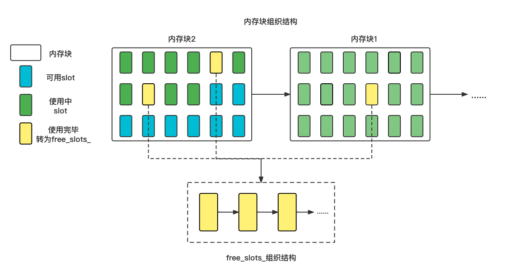

# SimpleAllocator

## 简介

一个自学用的项目，主要用于学习如何实现自己的内存池（内存分配器）

准确来说该项目无法定义为内存池，因为该数据结构只能存储单一类型的数据，所以叫内存分配器更合适。

**原项目**：Github：[MemoryPool](https://github.com/cacay/MemoryPool)

## 内存池结构

（结构图如果不显示请前往pic手动查看）

内存块结构：1.内部内存连续空间，分割为多个slot；2.内存块间以链表形式相连，新申请的内存块会插入链表的头部；

slot：存储元素的基本单位；

free_slots_：使用完并被释放的slot，以链表的形式组织。新的free_slot_会插入到链表的头部。

